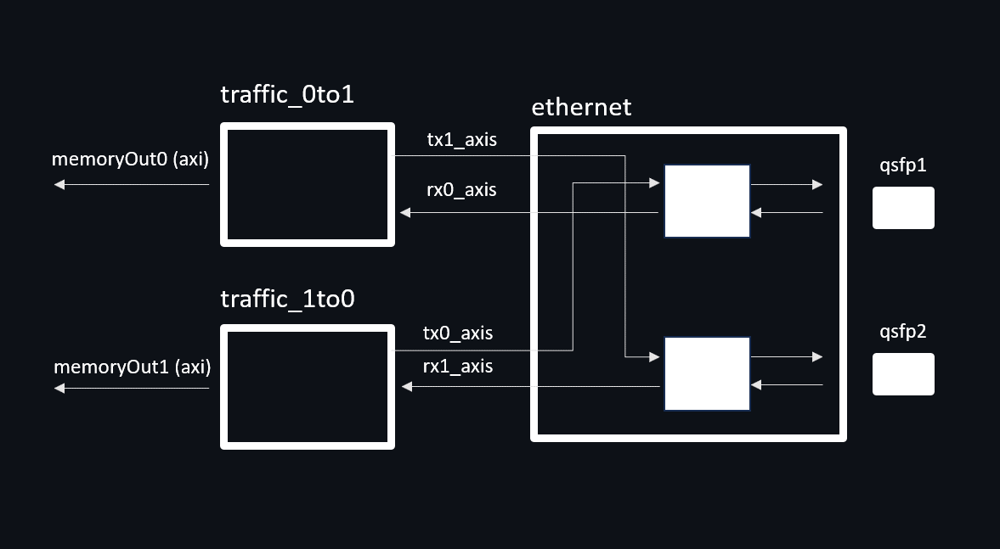

# packet-sniffing
This project provides an FPGA networking framework on the Alveo platform using the Vitis flow. This framework connects two 100Gbps network endpoints together while also able capturing the network traffic passing through the card. It is an excellent starting point for those unfamiliar with Vitis HLS, as this project includes an example of network processing.

I would like to thank “Design Gateway (Thailand)” for providing the test environment and support throughout this project. They offer a range of general FPGA solutions as well as valuable insights into HLS development. More information about their products can be found at [Design Gateway's solutions](https://dgway.com/solutions.html), and the details of HLS development can be found at [HLS Development Series](https://dgway.com/blog_E/category/hls-development-series/).


Additionally, this project could have not completed without [AMD-Xilinx Vitis Tutorials](https://github.com/Xilinx/Vitis-Tutorials/tree/2024.1), and I am grateful for being provided with such examples.

#### File structure
```
├───build - build directory and also used to run the application
├───docs - contains documents and pictures
├───ethernet_kernel - contains an RTL kernel for two-100Gpbs ethernet application
├───example - contains a sample cap file used for testing
├───host - contains C++ source code for the host software application
└───traffichandler_kernel - contains an HLS kernel for network traffic handler 
```

### System overview 


The following test environments are required to work with this project:
1. A Ubuntu 20.04 server with the Vitis 2024.1 platform installed (as described in this [link](https://www.xilinx.com/support/download/index.html/content/xilinx/en/downloadNav/alveo/u55c.html)).
2. An Alveo U55C card atteched to the host server.
3. Two test endpoints, running either Linux or Windows OS.
4. Four QSFP28 transceivers and two MPO-to-MPO cables for two 100Gbps connections. 

When this system is running, the two endpoints are connected via this framework. With this setup, either endpoint will not know that there's a man-in-the-middle and can normally communicate with each other. Not only can the framework receive and forware network packets in both directions, but also it can log the traffic ingressing in both directions. This is achieved by using a host memory DMA method of the Vitis platform for transferring desired network packets to a specific memory location in the host memory. The software application on the host machine can then access this particular memory to store it permanently in the server or to investigate it.


The logic behide this is the hardware includes three kernels - one ethernet kernel and two traffic kernels. As depicted below, the ethernet kernel is an RTL kernel, written in Verilog, responsible for handling two 100Gpbs physical layers, dealing with clock crossing, and splitting the traffic into four AXI-stream interfaces. The first traffic kernel named traffic_0to1 receives the ingressing network traffic of channel#1 and then forwards it to the egressing channel#2. Conversely, the other traffic kernel called traffic_1to0 receives the traffic from channel#2 and then forwards it to the channel#1. Furthermore, the software application can set specific rules for these traffic kernels to capture rule-matching packets in the host memory using AXI interface. It is worth noting that these traffic kernels use a single source code, developed using Vitis HLS.

Note: Please review this [document](https://docs.amd.com/r/en-US/ds978-u55c/Network-Interfaces) for the exact position of QSFP interface number on the actual board.



___

### Building the project
First and foremost, have the Vitis 2024.1 platform installed in your system. You can follow this [instruction](https://docs.amd.com/v/u/en-US/ug1468-alveo-u55c) provided by AMD.
After the enviroment is ready, open a terminal, change to the 'build' directory, and set up the Vitis enviroment.

```
~$ cd build
~/build$ source /tools/Xilinx/Vitis/2024.1/settings64.sh
~/build$ source /opt/xilinx/xrt/setup.sh
~/build$ export PLATFORM_REPO_PATHS='/opt/xilinx/platforms'
~/build$ export XILINX_PLATFORM='xilinx_u55c_gen3x16_xdma_3_202210_1'
~/build$ export DEVICE=${PLATFORM_REPO_PATHS}/${XILINX_PLATFORM}/${XILINX_PLATFORM}.xpfm
```

In this directory, there is a shell script, called 'buildall.sh', to build the project. This script starts by packaging necessary hardware objects, moving them into a temporary directory, building an XCLBIN file from these objects by the Vitis flow, and finally, compiling a host application. Please note that this process could potentially take a couple of hours to complete.

```
~/build$ ./buildall.sh
```

After running the shell, two files will be created in the current directory: packetsniffing.xclbin and host_exe. The first file in an AMD-Xilinx xclbin object for loading into the hardware (U55c), and the second is the executable file for the host software application.

___

### Demo walkthrough

Before running the application, it is required to set up an XRT environment variable beforehand. This is to allocate the memory in the host server for use in this system. In the below script, it allocates 1 GB of memory and sets the device user BDF to '01:00.1', which may vary by machine.

```
~/build$ sudo /opt/xilinx/xrt/bin/xbutil configure --host-mem -d 01:00.1 --size 1G enable
```

To run the application, simply run the executable file, which will also load the xclbin file into the hardware. After that, you will find the following text message as a guideline on how to use the application.

```
~/build$ ./host_exe

 packetsniffing on the alveo system example.

usage:
cu-name [command] [-option]
  cu-name      indicate one of the following kernels: ethernet, traffic_0to1, traffic_1to0
  [command]    ethernet    - 'getstatus' to query the current ethernet status
               traffic_xxx - 'getstatus' to query the current statistics
                           - 'setdestinationmac' setting the destination MAC address as a rule for capturing
                           - 'setsourcemac' setting the source MAC address as a rule for capturing
                           - 'setprotocol' setting the protocol as a rule for capturing, 0 for udp and 1 for tcp
                           - 'setsourceipaddress' setting the source IP address as a rule for capturing
                           - 'setdestinationipaddress' setting the destination IP address as a rule for capturing
                           - 'setsourceport' setting the source port as a rule for capturing
                           - 'setdestinationport' setting the destination port as a rule for capturing
                           - 'startcapture' to apply the filter rules and start capturing
                           - 'stopcapture' to stop capturing
  [-option]   'setdestinationmac'          - hexadecimal value as a MAC address starting with '0x'
              'setsourcemac'               - hexadecimal value as a MAC address starting with '0x'
              'setprotocol'                - decimal value in the range of 0 and 1
              'setsourceipaddress'         - decimal value with a specific format of x.x.x.x
              'setdestinationipaddress'    - decimal value with a specific format of x.x.x.x
              'setsourceport'              - decimal value in the range of 0 and 65535
              'setdestinationport'         - decimal value in the range of 0 and 65535
              'stopcapture'                - file directory to write the captured data


>> 
```

At this point, the hardware framework is now running, meaning the two endpoints connected to the U55c should be able to communicate with each other. To verify this, you should first enable the interfaces of the two test endpoints connecting to the U55c hardware, assign specific IP addresses to those interfaces, and then ping from one interface to the other, as shown in the below examples.

```
# endpoint#1
~$ sudo ifconfig enp1s0f0 up
~$ sudo ifconfig enp1s0f0 192.168.100.102/24
```

```
# endpoint#0
~$ sudo ifconfig eth1 up
~$ sudo ifconfig eth1 192.168.100.101/24
~$ ping 192.168.100.102
PING 192.168.100.102 (192.168.100.102) 56(84) bytes of data.
64 bytes from 192.168.100.102: icmp_seq=1 ttl=64 time=0.649 ms
64 bytes from 192.168.100.102: icmp_seq=2 ttl=64 time=0.335 ms
64 bytes from 192.168.100.102: icmp_seq=3 ttl=64 time=0.327 ms
64 bytes from 192.168.100.102: icmp_seq=4 ttl=64 time=0.383 ms
^C
--- 192.168.100.102 ping statistics ---
4 packets transmitted, 4 received, 0% packet loss, time 3068ms
rtt min/avg/max/mdev = 0.327/0.423/0.649/0.131 ms
~$ 
```

After confirming that the two endpoints can communicate, you must set specific rules through the host application (host_exe). In this example, the following network rules are set.

```
>> traffic_0to1 setdestinationmac 0x525400123502
set value = 0x525400123502
>> traffic_0to1 setprotocol 1
set value = 0x1
>> traffic_0to1 setsourceipaddress 10.0.2.15
set value = 0xa00020f
>> traffic_0to1 setdestinationipaddress 54.243.120.151
set value = 0x36f37897
>> traffic_0to1 setdestinationport 80
set value = 80
>>
```

Then enter this command in the host application prompt to start network traffic capturing in the path '0-to-1'.

```
>> traffic_0to1 startcapture
capturing is now started

>>
```

Now, any packets from interface 0-to-1 with the specific network parameters will be logged in the system. To test this, open another terminal in the test endpoint#0, which is connected to the QSFP1 (going from 0-to-1), change the directory to './example/', and then run the following. This example.cap file is taken from [packetlife.net](https://packetlife.net/captures/protocol/udp/) with the name of "Open Network Connection.pcapng".

```
~/example$ sudo tcpreplay --intf1=eth1 --pps=2 --stats=1 ./example.cap
Test start: 2024-07-25 12:50:49.161738 ...
Actual: 4 packets (337 bytes) sent in 1.50 seconds
Rated: 224.6 Bps, 0.001 Mbps, 2.66 pps
Actual: 6 packets (771 bytes) sent in 2.50 seconds
Rated: 308.3 Bps, 0.002 Mbps, 2.39 pps
.
.
.
Actual: 116 packets (23017 bytes) sent in 57.50 seconds
Rated: 400.2 Bps, 0.003 Mbps, 2.01 pps
Statistics for network device: eth1
        Successful packets:        116
        Failed packets:            0
        Truncated packets:         0
        Retried packets (ENOBUFS): 0
        Retried packets (EAGAIN):  0
~/example$ 
```

As the tcpreplay is running, it keeps sending the network packets in the example file to the Alveo U55c card and then to the test endpoint#1. It can be checked by either using Wireshark on the test endpoint#1 or getting a real-time network statistics on the host application, as shown below.

```
>> traffic_0to1 getstatus
traffic0to1 kernel status
number of rx packets = 18
number of rx bytes = 1814
number of rx discarded packets = 0
number of rx discarded bytes = 0
number of rx captured packets = 16
number of rx captured bytes = 1634
number of tx packets = 18
number of tx bytes = 1814
number of tx dropped packets = 0
number of tx dropped bytes = 0
number of filtered packets = 0
number of filtered bytes = 0
number of stored packets = 0
number of stored bytes = 0
>> 
.
.
>> traffic_0to1 getstatus
traffic0to1 kernel status
number of rx packets = 118
number of rx bytes = 23341
number of rx discarded packets = 0
number of rx discarded bytes = 0
number of rx captured packets = 116
number of rx captured bytes = 23161
number of tx packets = 118
number of tx bytes = 23341
number of tx dropped packets = 0
number of tx dropped bytes = 0
number of filtered packets = 13
number of filtered bytes = 11497
number of stored packets = 13
number of stored bytes = 11712
```

After the tcpreplay finishes, the number of stored packets should be 13. And to stop capturing the packets and to view the result, use the following command on the host application prompt.

```
>> traffic_0to1 stopcapture result_log.txt
number of captured bytes = 11712
File has been created and written

>>
```

In this example, 'result_log.txt' file will be created in the 'build' directory, and this can be viewed by any text editor. It is probably best to see in binary format. The example below shows the first two network packets captured and stored in the system. Please note that there could be some bytes after the end of each captured packet that contain an unknown value due to the fact that this system uses 64-byte alignment. The length of the two packets below is 62 bytes, so there is a 2-byte null value at the end of each packet. 

```
Address    0  1  2  3  4  5  6  7  8  9  a  b  c  d  e  f
00000000  52 54 00 12 35 02 08 00 27 63 cf 53 08 00 45 00
00000010  00 30 00 6b 40 00 80 06 3e c4 0a 00 02 0f 36 f3
00000020  78 97 04 0f 00 50 e6 ec b1 6b 00 00 00 00 70 02
00000030  fa f0 2f de 00 00 02 04 05 b4 01 01 04 02 2f f1
00000040  52 54 00 12 35 02 08 00 27 63 cf 53 08 00 45 00
00000050  00 30 00 6c 40 00 80 06 3e c3 0a 00 02 0f 36 f3
00000060  78 97 04 0f 00 50 e6 ec b1 6b 00 00 00 00 70 02
00000070  fa f0 2f de 00 00 02 04 05 b4 01 01 04 02 50 5e
```

___

### Improvements and Suggestions
1. This project does not initially aim for reliability. Therefore, it is essential to review, optimise and adjust the whole system, both hardware and software.
2. In the memory access part of the hardware, it would be better if it can access in byte unit, leaving no null value in the memory. Also, the speed at which the HLS kernels write the network packets to the memory using AXI interface can be improved.
3. There can be more kernels added in this project.
4. Loading an XCLBIN file should not be done by the host application because the hardware should be free-running and the software can be called multiple times. However, an efficient XRT native API for connecting to the device without loading an XCLBIN has not been found.
5. Other Alveo cards, such as U250, can utilise this framework.

Thank you for your participation in this project, and I hope that you can put the work to good use.
